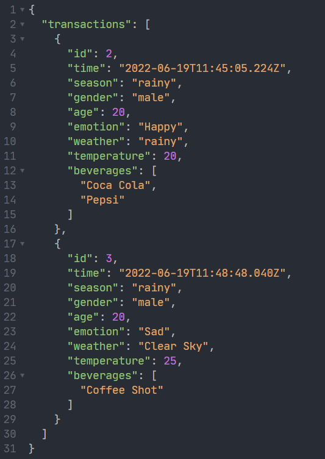
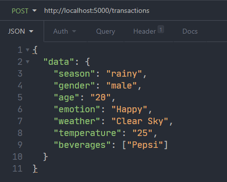
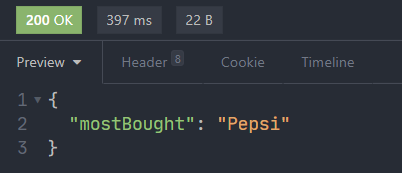
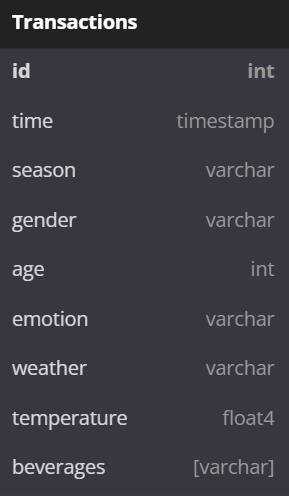

# Data Collector for [Beverage Recommendation System](https://github.com/Eessh/beverage-recommendation-system/)

Just a simple api, having only 4 methods:
- Get all transactions, endpoint: `/transactions`
- Add a transaction, endpoint: `/transactions`
- Clear all transactions, endpoint: `/transactions`
- Get most bought beverage, endpoint: `/mostBought`

### Sample response of: `Get all transactions`

### Sample request of: `Add transaction`

### Sample response of: `Most bought beverage`

### Database consists of only one table: `Transactions`
