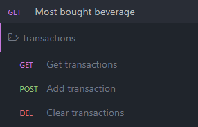

# Data Collector for [Beverage Recommendation System](https://github.com/Eessh/beverage-recommendation-system/)

Just a simple api, having only 4 methods:
- Get all transactions, endpoint: `/transactions`
- Add a transaction, endpoint: `/transactions`
- Clear all transactions, endpoint: `/transactions`
- Get most bought beverage, endpoint: `/mostBought`

